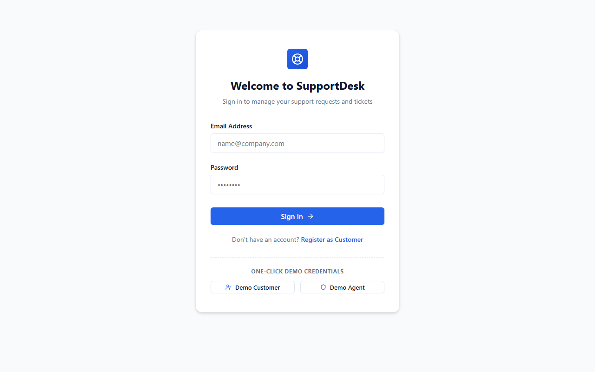
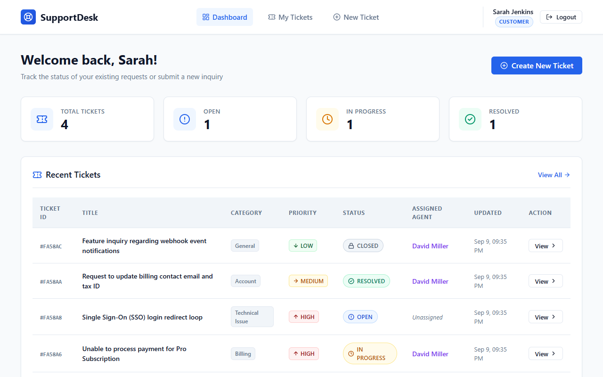
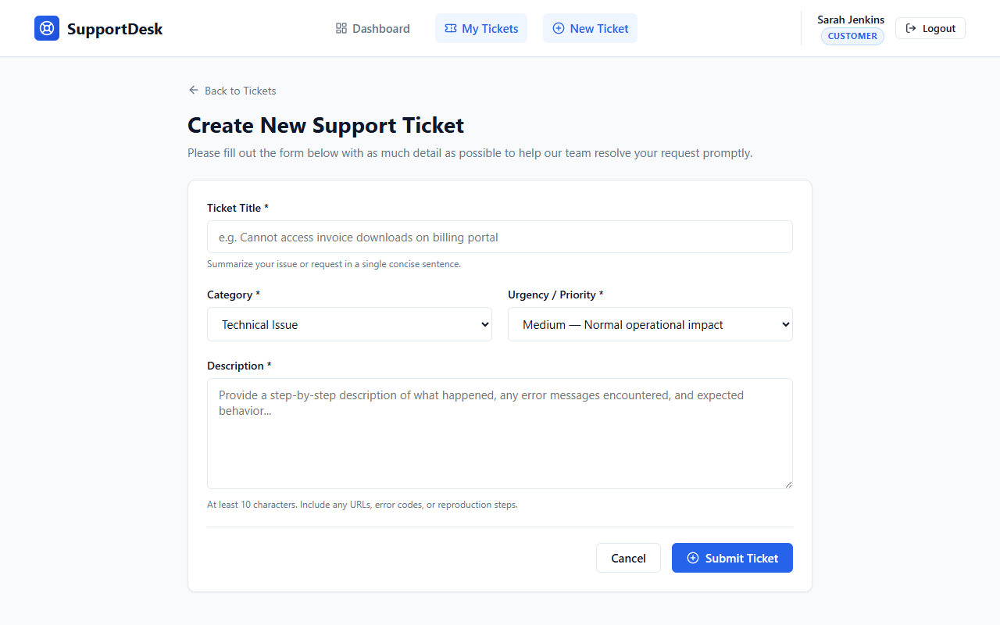
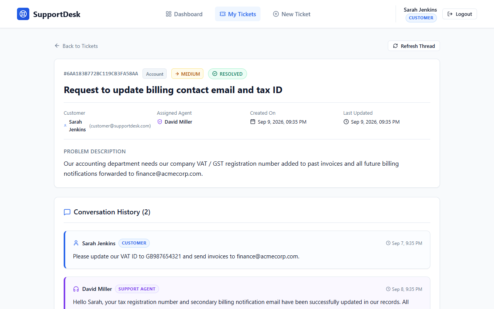
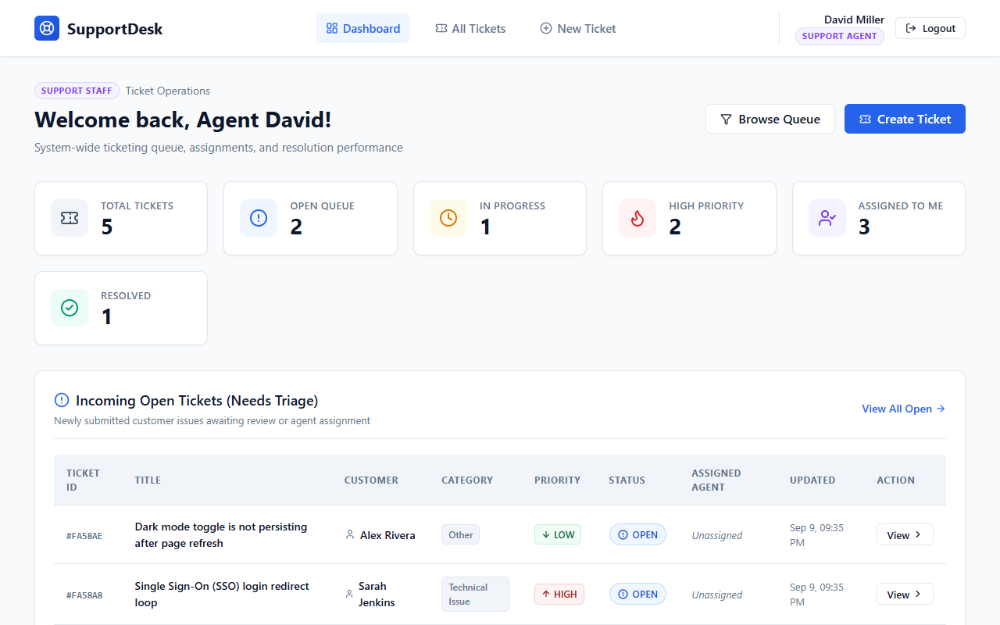
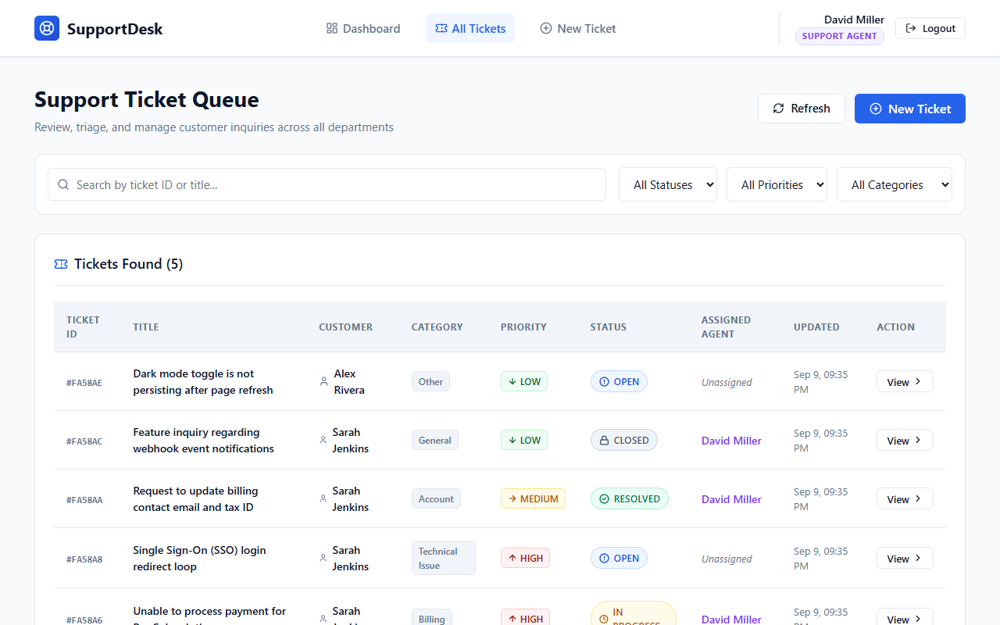

# SupportDesk — Customer Support Ticketing System

> **Pre-Internship Technical Assessment**  
> **Candidate Track:** Full Stack Developer Intern  
> **Evaluation Flow:** Requirement → Design → Development → Database → API → UI → Testing → Delivery  

SupportDesk is a clean, modern, and maintainable full-stack customer support ticketing platform. It empowers customers to raise structured support requests, track ticket lifecycles, and engage in real-time conversation threads with support staff. Concurrently, it equips support agents with queue triage tools, priority filters, ownership assignment, and status management.

---

## Table of Contents

1. [Project Overview & Key Features](#project-overview--key-features)
2. [Technology Stack](#technology-stack)
3. [Architecture & Project Structure](#architecture--project-structure)
4. [Database & Schema Design](#database--schema-design)
5. [API Specification](#api-specification)
6. [Authentication & Role-Based Access Control (RBAC)](#authentication--role-based-access-control-rbac)
7. [Installation & Setup Instructions](#installation--setup-instructions)
8. [Environment Variables](#environment-variables)
9. [Database Configuration (MongoDB & PostgreSQL Guide)](#database-configuration)
10. [Demo Credentials & Seed Data](#demo-credentials--seed-data)
11. [Automated Testing & Verification](#automated-testing--verification)
12. [Application Screenshots](#application-screenshots)
13. [Key Assumptions & Engineering Decisions](#key-assumptions--engineering-decisions)
14. [Challenges Encountered & Solutions](#challenges-encountered--solutions)
15. [Technical Discussion Q&A (Assessment Defense)](#technical-discussion-qa)
16. [Future Improvements](#future-improvements)

---

## 1. Project Overview & Key Features

### For Customers
- **Self-Service Onboarding & Authentication:** Secure registration and login with encrypted password storage (bcrypt) and persistent JWT sessions.
- **Dedicated Customer Dashboard:** Dynamic statistics tracking personal tickets (Total, Open, In Progress, Resolved).
- **Ticket Creation:** Form with input validation, severity selection (`LOW`, `MEDIUM`, `HIGH`), and categorized routing (`Technical Issue`, `Billing`, `Account`, `General`, `Other`).
- **Data Isolation:** Strict backend enforcement ensuring customers can only inspect and reply to their own tickets.
- **Interactive Conversation History:** Complete chronological message history showing customer and agent replies with distinct visual roles.

### For Support Agents
- **Triage & Operations Dashboard:** Real-time visibility into the system-wide queue: Total Tickets, Open Queue, In Progress, High Priority, Assigned to Me, and Resolved.
- **Queue Search & Multi-Criteria Filtering:** Instant search by Ticket ID or Title keywords; filter by Status, Priority, and Category.
- **Ownership & Assignment:** One-click "Assign to Me" or assignment to colleagues, automatically transitioning tickets from `OPEN` to `IN_PROGRESS`.
- **Ticket Lifecycle Management:** Transition ticket statuses (`OPEN` → `IN_PROGRESS` → `RESOLVED` → `CLOSED`) and modify priority levels as issues develop.
- **Staff Communication:** Send replies directly to customer tickets with distinctive support staff badges.

---

## 2. Technology Stack

| Layer | Technology | Rationale |
| :--- | :--- | :--- |
| **Frontend** | **React 18** + **Vite** | Fast Hot-Module Replacement (HMR), component-driven UI, minimal bundle footprint. |
| **Routing** | **React Router DOM v6** | Declarative client-side routing, protected route wrappers, search param sync. |
| **API Client** | **Axios** | Centralized instance with request/response interceptors for JWT injection and 401 handling. |
| **Styling** | **Modern CSS3 (Variables & Flex/Grid)** | Custom, accessible, lightweight responsive design system without heavy bloated UI frameworks. |
| **Icons** | **Lucide React** | Clean, accessible SVG iconography for badges, metrics, and navigation. |
| **Backend** | **Node.js** + **Express.js** | Non-blocking I/O, modular layered architecture, robust middleware ecosystem. |
| **Database** | **MongoDB** + **Mongoose ODM** | Document-based schema with strict Mongoose validation, fast indexing, and flexible embedding. |
| **Security** | **bcryptjs** + **JSON Web Tokens (JWT)** | Salted password hashing (cost factor 10), stateless authorization tokens with expiration. |
| **Testing** | **Node.js Test Runner / Custom Integration Suite** | Automated end-to-end API integration tests validating auth, RBAC, CRUD, and isolation. |

---

## 3. Architecture & Project Structure

The project follows a clean **Separation of Concerns** using a decoupled client-server structure:

```
Customer_support_ticketing_system/
├── backend/
│   ├── src/
│   │   ├── config/
│   │   │   ├── db.js                 # Mongoose connection with error handling
│   │   │   └── env.js                # Centralized environment variable exports
│   │   ├── models/
│   │   │   ├── User.js               # User schema (name, email, password, role)
│   │   │   ├── Ticket.js             # Ticket schema (customer, title, desc, cat, prio, status, agent)
│   │   │   └── TicketMessage.js      # Message schema (ticket, sender, message, timestamps)
│   │   ├── middleware/
│   │   │   ├── authMiddleware.js     # Bearer JWT verification & req.user attachment
│   │   │   ├── roleMiddleware.js     # Role authorization guard (CUSTOMER vs AGENT)
│   │   │   ├── validateMiddleware.js # Input sanitization & validation rules
│   │   │   └── errorMiddleware.js    # Global error handler & 404 handler
│   │   ├── controllers/
│   │   │   ├── authController.js     # Auth request handling (register, login, me)
│   │   │   ├── ticketController.js   # Ticket CRUD, search, filter, and assignment
│   │   │   ├── messageController.js  # Ticket conversation thread operations
│   │   │   └── dashboardController.js# Dynamic metrics aggregation
│   │   ├── services/
│   │   │   ├── authService.js        # Auth business logic & token issuance
│   │   │   ├── ticketService.js      # Ticket business rules & access checks
│   │   │   ├── messageService.js     # Message creation & thread retrieval
│   │   │   └── dashboardService.js   # Database count & aggregation queries
│   │   ├── routes/
│   │   │   ├── authRoutes.js         # /api/auth
│   │   │   ├── ticketRoutes.js       # /api/tickets (includes nested message routes)
│   │   │   ├── messageRoutes.js      # /api/tickets/:id/messages
│   │   │   └── dashboardRoutes.js    # /api/dashboard
│   │   ├── seed/
│   │   │   └── seed.js               # Development seed script
│   │   └── app.js                    # Express app initialization & middleware stack
│   ├── server.js                     # HTTP server entry point
│   ├── tests/
│   │   └── api.test.js               # Automated integration test suite (15 tests)
│   ├── .env.example
│   └── package.json
│
├── frontend/
│   ├── src/
│   │   ├── api/
│   │   │   └── axiosClient.js        # Configured Axios instance with JWT interceptor
│   │   ├── context/
│   │   │   └── AuthContext.jsx       # Global auth state (user, token, login, logout)
│   │   ├── components/
│   │   │   ├── common/
│   │   │   │   ├── Navbar.jsx        # Sticky navigation with role badges and sign-out
│   │   │   │   ├── StatusBadge.jsx   # Status indicator badge (OPEN, IN_PROGRESS, RESOLVED, CLOSED)
│   │   │   │   ├── PriorityBadge.jsx # Priority indicator (LOW, MEDIUM, HIGH)
│   │   │   │   ├── StatCard.jsx      # Metrics overview cards
│   │   │   │   ├── ProtectedRoute.jsx# Role-gated frontend route guard
│   │   │   │   ├── LoadingSpinner.jsx# Accessible loading state
│   │   │   │   └── EmptyState.jsx    # Clean empty state with action CTAs
│   │   │   └── tickets/
│   │   │       ├── TicketFilter.jsx  # Search bar + status/priority/category dropdowns
│   │   │       ├── TicketTable.jsx   # Responsive ticket table and mobile card layout
│   │   │       ├── MessageThread.jsx # Conversation timeline with sender role badges
│   │   │       └── ReplyBox.jsx      # Reply composer with validation
│   │   ├── pages/
│   │   │   ├── LoginPage.jsx         # Login page with 1-Click Demo Fill buttons
│   │   │   ├── RegisterPage.jsx      # Customer registration form
│   │   │   ├── CustomerDashboard.jsx # Customer overview, ticket summary, recent list
│   │   │   ├── AgentDashboard.jsx    # Agent workload metrics, queue status, triage
│   │   │   ├── TicketsPage.jsx       # Full tickets list with search & filter
│   │   │   ├── CreateTicketPage.jsx  # Ticket creation form
│   │   │   ├── TicketDetailsPage.jsx # Full thread, assignment & status transition actions
│   │   │   └── NotFoundPage.jsx
│   │   ├── styles/
│   │   │   └── index.css             # Polished CSS design system
│   │   ├── App.jsx                   # Router switch & role-based dashboard router
│   │   └── main.jsx
│   ├── index.html
│   ├── vite.config.js                # Port 3000 & /api reverse proxy configuration
│   └── package.json
│
├── screenshots/                      # Major application screens
└── README.md
```

---

## 4. Database & Schema Design

### MongoDB Collection Models (Mongoose)

#### 1. `User` Model
```javascript
{
  name: { type: String, required: true, trim: true },
  email: { type: String, required: true, unique: true, lowercase: true, trim: true },
  password: { type: String, required: true, minlength: 6 }, // Hashed via bcrypt
  role: { type: String, enum: ['CUSTOMER', 'AGENT'], default: 'CUSTOMER' },
  createdAt: Date,
  updatedAt: Date
}
```

#### 2. `Ticket` Model
```javascript
{
  customer: { type: Schema.Types.ObjectId, ref: 'User', required: true, index: true },
  title: { type: String, required: true, trim: true, minlength: 3, maxlength: 120 },
  description: { type: String, required: true, trim: true, minlength: 10 },
  category: { 
    type: String, 
    enum: ['Technical Issue', 'Billing', 'Account', 'General', 'Other'], 
    required: true,
    index: true
  },
  priority: { 
    type: String, 
    enum: ['LOW', 'MEDIUM', 'HIGH'], 
    default: 'MEDIUM',
    index: true 
  },
  status: { 
    type: String, 
    enum: ['OPEN', 'IN_PROGRESS', 'RESOLVED', 'CLOSED'], 
    default: 'OPEN',
    index: true 
  },
  assignedAgent: { type: Schema.Types.ObjectId, ref: 'User', default: null, index: true },
  createdAt: Date,
  updatedAt: Date
}
```

#### 3. `TicketMessage` Model
```javascript
{
  ticket: { type: Schema.Types.ObjectId, ref: 'Ticket', required: true, index: true },
  sender: { type: Schema.Types.ObjectId, ref: 'User', required: true },
  message: { type: String, required: true, trim: true, minlength: 1 },
  createdAt: Date,
  updatedAt: Date
}
```

---

## 5. API Specification

All protected endpoints require an `Authorization: Bearer <jwt_token>` header.

### Authentication (`/api/auth`)
| Method | Endpoint | Access | Description |
| :--- | :--- | :--- | :--- |
| `POST` | `/api/auth/register` | Public | Register a new customer (`name`, `email`, `password`). |
| `POST` | `/api/auth/login` | Public | Authenticate user; returns JWT token + user profile. |
| `GET` | `/api/auth/me` | Protected | Returns profile of the authenticated session. |

### Tickets (`/api/tickets`)
| Method | Endpoint | Access | Description |
| :--- | :--- | :--- | :--- |
| `GET` | `/api/tickets` | Protected | List tickets. Customers see own; Agents see all. Supports `?search=`, `?status=`, `?priority=`, `?category=`. |
| `POST` | `/api/tickets` | Protected | Create new ticket (`title`, `description`, `category`, `priority`). |
| `GET` | `/api/tickets/:id` | Protected | Get ticket details with populated customer & agent. Enforces customer isolation. |
| `PATCH` | `/api/tickets/:id` | Agent Only | Update ticket `status`, `priority`, or `category`. |
| `PATCH` | `/api/tickets/:id/assign` | Agent Only | Assign ticket to an agent or take ownership. Auto-transitions to `IN_PROGRESS`. |

### Messages (`/api/tickets/:id/messages`)
| Method | Endpoint | Access | Description |
| :--- | :--- | :--- | :--- |
| `GET` | `/api/tickets/:id/messages` | Protected | Fetch conversation thread history with populated sender info. |
| `POST` | `/api/tickets/:id/messages` | Protected | Post reply message. Customer restricted to own tickets; Agents can reply to all. |

### Dashboard (`/api/dashboard`)
| Method | Endpoint | Access | Description |
| :--- | :--- | :--- | :--- |
| `GET` | `/api/dashboard/stats` | Protected | Dynamic metrics (`total`, `open`, `inProgress`, `resolved`, `closed`, `highPriority`, `assignedToMe`). Scoped by role. |

### Health Check
| Method | Endpoint | Access | Description |
| :--- | :--- | :--- | :--- |
| `GET` | `/api/health` | Public | Returns service uptime and operational status. |

---

## 6. Authentication & Role-Based Access Control (RBAC)

1. **Password Security:** All passwords are automatically salted and hashed using `bcryptjs` (salt rounds: 10) in a Mongoose pre-save hook. Plain text passwords are never stored or returned in responses.
2. **Stateless JWT Tokens:** Tokens are signed using `jsonwebtoken` with HMAC-SHA256 and configurable expiration (default 7 days).
3. **Backend-Enforced Authorization:**
   - Authorization is enforced in middleware: `protect` verifies token authenticity and extracts user identity; `authorize('AGENT')` restricts staff-only routes.
   - Ownership checks are enforced in service logic: Customers attempting to access another user's ticket or post a message to it receive a `403 Forbidden` response.
4. **Frontend Route Guards:**
   - `<ProtectedRoute />` redirects unauthenticated visitors to `/login`.
   - The root route dynamically switches between `<CustomerDashboard />` and `<AgentDashboard />` based on `user.role`.

---

## 7. Installation & Setup Instructions

### Prerequisites
- **Node.js** (v18.x or higher)
- **npm** (v9.x or higher)
- **MongoDB** (running locally on port `27017` or MongoDB Atlas URI)

### Step 1: Clone Repository
```bash
git clone <your-repository-url>
cd Customer_support_ticketing_system
```

### Step 2: Install Dependencies
```bash
# Install backend dependencies
cd backend
npm install

# Install frontend dependencies
cd ../frontend
npm install
```

### Step 3: Configure Environment Variables
Inside `backend/`, copy the example `.env` file:
```bash
cd ../backend
cp .env.example .env
```
*(On Windows PowerShell: `Copy-Item .env.example .env`)*

### Step 4: Seed Development Data
Populate the database with realistic demo accounts, sample tickets, and conversation threads:
```bash
cd backend
npm run seed
```

### Step 5: Start the Application

**Terminal 1 (Backend Server):**
```bash
cd backend
npm start
# Server starts on http://localhost:5000
```

**Terminal 2 (Frontend Client):**
```bash
cd frontend
npm run dev
# Client starts on http://localhost:3000
```

Open your browser and navigate to **`http://localhost:3000`**.

---

## 8. Environment Variables

### Backend (`backend/.env`)
| Variable | Default Value | Description |
| :--- | :--- | :--- |
| `PORT` | `5000` | Port for the Express server to listen on. |
| `NODE_ENV` | `development` | Runtime environment (`development` / `production`). |
| `MONGODB_URI` | `mongodb://127.0.0.1:27017/supportdesk` | MongoDB connection URI string. |
| `JWT_SECRET` | `supportdesk_jwt_super_secret_key_change_in_production_2026` | Secret key used to sign and verify JWTs. |
| `JWT_EXPIRES_IN` | `7d` | Lifespan of generated JWT tokens. |

### Frontend (`frontend/.env`)
| Variable | Default Value | Description |
| :--- | :--- | :--- |
| `VITE_API_URL` | `/api` | Base API URL (defaults to Vite dev reverse proxy). |

---

## 9. Database Configuration

### MongoDB Setup (Implemented Engine)
1. Ensure MongoDB service is running locally on port `27017` (e.g. `net start MongoDB` on Windows).
2. Set `MONGODB_URI=mongodb://127.0.0.1:27017/supportdesk` in `backend/.env`.
3. If using MongoDB Atlas:
   `MONGODB_URI=mongodb+srv://<username>:<password>@cluster0.mongodb.net/supportdesk?retryWrites=true&w=majority`

### PostgreSQL Configuration Guide (Alternative / Migration Reference)
Should your enterprise environment utilize PostgreSQL instead of MongoDB:

1. **Install PostgreSQL Client:**
   ```bash
   npm install pg sequelize # or prisma / knex
   ```

2. **Connection Parameters (`.env`):**
   ```env
   PG_HOST=localhost
   PG_PORT=5432
   PG_DATABASE=supportdesk
   PG_USER=postgres
   PG_PASSWORD=your_password
   ```

3. **Relational DDL Schema:**
   ```sql
   CREATE TYPE user_role AS ENUM ('CUSTOMER', 'AGENT');
   CREATE TYPE ticket_priority AS ENUM ('LOW', 'MEDIUM', 'HIGH');
   CREATE TYPE ticket_status AS ENUM ('OPEN', 'IN_PROGRESS', 'RESOLVED', 'CLOSED');

   CREATE TABLE users (
     id UUID PRIMARY KEY DEFAULT gen_random_uuid(),
     name VARCHAR(100) NOT NULL,
     email VARCHAR(255) UNIQUE NOT NULL,
     password VARCHAR(255) NOT NULL,
     role user_role DEFAULT 'CUSTOMER',
     created_at TIMESTAMP WITH TIME ZONE DEFAULT NOW(),
     updated_at TIMESTAMP WITH TIME ZONE DEFAULT NOW()
   );

   CREATE TABLE tickets (
     id UUID PRIMARY KEY DEFAULT gen_random_uuid(),
     customer_id UUID NOT NULL REFERENCES users(id) ON DELETE CASCADE,
     title VARCHAR(150) NOT NULL,
     description TEXT NOT NULL,
     category VARCHAR(50) NOT NULL,
     priority ticket_priority DEFAULT 'MEDIUM',
     status ticket_status DEFAULT 'OPEN',
     assigned_agent_id UUID REFERENCES users(id) ON DELETE SET NULL,
     created_at TIMESTAMP WITH TIME ZONE DEFAULT NOW(),
     updated_at TIMESTAMP WITH TIME ZONE DEFAULT NOW()
   );

   CREATE TABLE ticket_messages (
     id UUID PRIMARY KEY DEFAULT gen_random_uuid(),
     ticket_id UUID NOT NULL REFERENCES tickets(id) ON DELETE CASCADE,
     sender_id UUID NOT NULL REFERENCES users(id) ON DELETE CASCADE,
     message TEXT NOT NULL,
     created_at TIMESTAMP WITH TIME ZONE DEFAULT NOW()
   );
   ```

---

## 10. Demo Credentials & Seed Data

For convenience during assessment review and technical interviews, the login screen includes **1-Click Quick Fill buttons**. You can also enter credentials manually:

| Role | Email | Password | Access / Capabilities |
| :--- | :--- | :--- | :--- |
| **Demo Customer** | `customer@supportdesk.com` | `password123` | Can create tickets, view own tickets, and reply to own conversation threads. |
| **Second Customer** | `alex@example.com` | `password123` | Demonstrates cross-customer data isolation and ownership boundaries. |
| **Demo Support Agent** | `agent@supportdesk.com` | `password123` | Can view all tickets, search & filter, take ownership, update status/priority, and reply. |

---

## 11. Automated Testing & Verification

An automated end-to-end integration test suite is located in `backend/tests/api.test.js`.

### Running Automated Tests
```bash
cd backend
npm test
```

### Test Coverage (15 Comprehensive Test Cases)
1. **Health Check:** `GET /api/health` returns status `UP`.
2. **Customer Authentication:** `POST /api/auth/login` returns valid JWT and user payload.
3. **Agent Authentication:** `POST /api/auth/login` verifies agent credentials and role.
4. **Token Enforcement:** Accessing `/api/tickets` without token rejects with `401 Unauthorized`.
5. **Ticket Creation:** Customer successfully creates ticket initialized to `OPEN`.
6. **Customer Isolation:** `GET /api/tickets` only returns tickets belonging to the authenticated customer.
7. **Cross-Customer Boundary:** Customer 2 attempting to view Customer 1's ticket fails with `403 Forbidden`.
8. **Role RBAC Guard:** Customer attempting to update ticket status via `PATCH` fails with `403 Forbidden`.
9. **Agent Assignment:** Agent assigns ticket to self; status automatically transitions to `IN_PROGRESS`.
10. **Status Lifecycle:** Agent updates ticket status to `RESOLVED`.
11. **Conversation Reply:** Customer posts reply to ticket conversation thread.
12. **Close Ticket:** Agent closes the ticket after customer reply; status transitions to `CLOSED`.
13. **Thread Retrieval:** `GET /api/tickets/:id/messages` returns messages populated with author roles.
14. **Dynamic Dashboard:** Database aggregation calculates accurate real-time metrics.
15. **Search & Filter:** Multi-criteria queries filter correctly by status and priority.

---

## 12. Application Screenshots

### 1. Login Page (with One-Click Demo Credentials)


### 2. Customer Dashboard


### 3. Create Ticket Page


### 4. Ticket Details & Conversation History


### 5. Support Agent Operations Dashboard


### 6. Support Agent Queue (Search & Filtering)


---

## 13. Key Assumptions & Engineering Decisions

1. **Lightweight Core MVP:** Focused on rock-solid core workflow over feature sprawl. Avoided adding file attachments, Docker, or web sockets prematurely to maintain code cleanliness and maintainability.
2. **Strict Backend Enforcement:** Frontend route guards provide an intuitive UX, but security is strictly enforced on the API layer through JWT middleware and resource ownership validation.
3. **RESTful Resource Nesting:** Ticket conversation messages are modeled under `/api/tickets/:id/messages` using Express `mergeParams: true`, accurately reflecting message ownership.
4. **Zero-Configuration Vite Proxy:** Configured Vite dev server to proxy `/api` requests to port `5000`, eliminating Cross-Origin Resource Sharing (CORS) complications during local development.

---

## 14. Challenges Encountered & Solutions

| Challenge | Root Cause | Solution |
| :--- | :--- | :--- |
| **Error Status Code Propagation** | Custom errors thrown in service methods (`error.statusCode = 403`) were returning 500 when Express `res.statusCode` defaulted to 200. | Updated `errorMiddleware.js` to prioritize `err.statusCode || (res.statusCode === 200 ? 500 : res.statusCode)`. |
| **Cross-Customer Data Isolation** | Ensuring customers cannot access or manipulate other users' tickets even with valid JWT tokens. | Implemented ownership check in `ticketService.js` and `messageService.js`: verified `ticket.customer._id === req.user._id` for customer roles, returning `403 Forbidden`. |
| **Dynamic Dashboard Query Performance** | Calculating metrics without running sequential blocking database queries. | Utilized `Promise.all` with indexed Mongoose `countDocuments()` queries and MongoDB aggregation pipelines to calculate metrics in a single network round-trip. |

---

## 15. Technical Discussion Q&A

*(Aligned with Assessment Section 10: Technical Discussion Preparation)*

#### Q1: Why did you choose your technology stack?
> **A:** React and Vite provide instant developer feedback with fast build times and a component-based architecture ideal for dynamic state (dashboards, conversation timelines). Node.js and Express offer a lightweight, non-blocking asynchronous REST backend with straightforward middleware pipelines. MongoDB with Mongoose was chosen for rapid modeling of flexible ticket structures, built-in validation, and efficient referencing via ObjectIds.

#### Q2: How did you structure the application?
> **A:** I implemented a layered architecture separating concerns into **Routes → Middleware → Controllers → Services → Models**. Controllers handle HTTP contracts, Services execute business rules and validation, and Middleware enforces cross-cutting concerns (authentication, authorization, and error handling).

#### Q3: How does authentication work?
> **A:** When a user logs in, their password is verified against the bcrypt hash. Upon verification, the server issues a signed JWT containing the user's ID. The client stores this token and includes it in the `Authorization: Bearer <token>` header for subsequent requests. The `protect` middleware decodes the token, retrieves the user from the database, and attaches it to `req.user`.

#### Q4: How did you design the database?
> **A:** I designed three primary collections: `User`, `Ticket`, and `TicketMessage`. Relationships are modeled using MongoDB ObjectId references (`ref: 'User'`, `ref: 'Ticket'`). Indexes were added on foreign keys (`customer`, `assignedAgent`) and frequent query filters (`status`, `priority`, `createdAt`) to ensure \(O(\log N)\) query performance.

#### Q5: How does the frontend communicate with the backend?
> **A:** Communication is handled via Axios configured with request and response interceptors. The request interceptor attaches the Bearer token, while the response interceptor catches 401 Unauthorized responses to clear expired sessions and prompt re-authentication. In development, Vite reverse-proxies `/api` to avoid CORS friction.

#### Q6: How did you implement role-based access?
> **A:** Roles (`CUSTOMER`, `AGENT`) are stored on the User document and validated on both layers. On the backend, `authorize('AGENT')` restricts endpoints like status updates or assignments, while service logic ensures Customers can only query or reply to tickets where `ticket.customer === req.user._id`. On the frontend, `<ProtectedRoute />` and the role router prevent unauthorized navigation.

#### Q7: What was the most difficult part of the assessment?
> **A:** Balancing complete end-to-end functionality (auth, RBAC, thread messaging, dynamic dashboard calculations, responsive UI) while keeping the codebase lightweight, understandable, and free of over-engineering so every single line can be confidently defended in a technical interview.

#### Q8: What would you improve with another week?
> **A:** 
> 1. Real-time updates for conversation threads using WebSockets (Socket.io) or Server-Sent Events (SSE).
> 2. Secure file attachments (e.g. AWS S3 or Cloudinary presigned uploads for screenshots/logs).
> 3. Email notifications on ticket status transitions via SendGrid or Nodemailer.
> 4. Cursor-based pagination for high-volume enterprise ticket queues.

---

## 16. Future Improvements

- **Email Alerts:** Automated notifications sent to customers when agents reply or change ticket status.
- **Attachment Support:** Uploading logs, screenshots, and error diagnostics directly to tickets.
- **SLA Tracking:** Visual countdown timers for response deadlines based on priority.
- **Containerization:** Multi-stage Dockerfile and `docker-compose.yml` for unified one-command startup.
- **AI Assist:** Smart auto-tagging, priority suggestion, and canned response generation using Gemini API.

---

*Delivered with pride for the **NxtWise IT Pvt. Ltd** Full Stack Developer Internship Assessment.*
